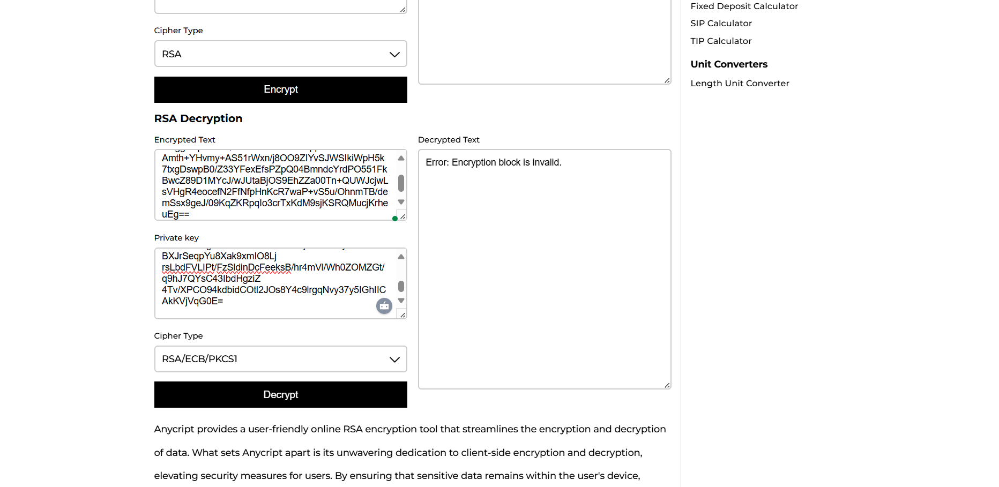

# Use a specific Browser

> Access the hidden flag. Browsers will not reveal the secret.&#x20;
>
> Access Web Flag format: BOCTF{}

<figure><figcaption></figcaption></figure>

<figure><figcaption></figcaption></figure>



**Solution:** This type of problem is a browser-related problem. Though it said that browsers will not reveal the secret, we can use browser automation or browser weaponizing tools like Burp Suite.

First, open page request at Burp Suite. Send the request to intruder.

<figure><figcaption></figcaption></figure>

From the intrusion detection tab, select the user-agent.

Get payloads (user agent lists) from open source.\
e.g.: [https://www.useragentstring.com/pages/All/](https://www.useragentstring.com/pages/All/)

<figure><figcaption></figcaption></figure>

Then start the attack to see the result.&#x20;

<figure><figcaption></figcaption></figure>

From the content length, of the attack, we can see an unusual content length for (Mozilla/5.0 (Windows NT 10.0; Win64; x64; rv:52.0) Gecko/20100101 Firefox/52.0 Cyberfox/52.8.0)

<figure><figcaption></figcaption></figure>

Now, open a fresh browser. Go to the target page. Get browser extension: [https://microsoftedge.microsoft.com/addons/detail/useragent-switcher-and-m/cnjkedgepfdpdbnepgmajmmjdjkjnifa](https://microsoftedge.microsoft.com/addons/detail/useragent-switcher-and-m/cnjkedgepfdpdbnepgmajmmjdjkjnifa)

Select for the Firefox browser version: 52

<figure><figcaption></figcaption></figure>

**Boom!** The flag was revealed!

<figure><figcaption></figcaption></figure>

